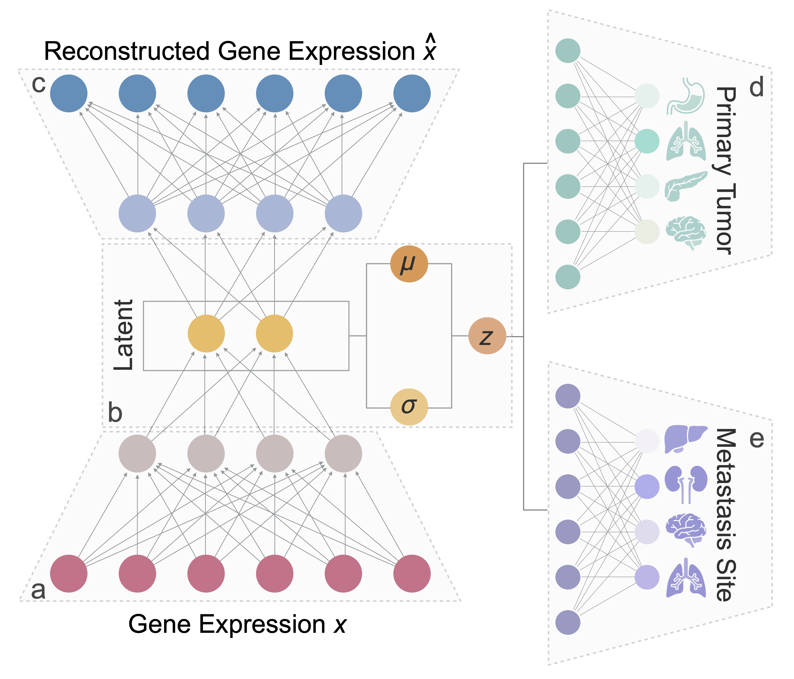

# PreMet: Predicting Metastasis sites from the transcriptomes of primary tumors

***

PreMet is a Variational Autoencoder (VAE)-based model for predicting metastasis potential solely from primary tumor trnascriptional profiles.

*** 

Requirements

***

Reproducibility

- [Data pre-processing](https://github.com/loooooooopi/PreMet/blob/main/Reproducibility/data_preprocessing.ipynb)

***

Train model on new data: 

Predict metasistas site: 
